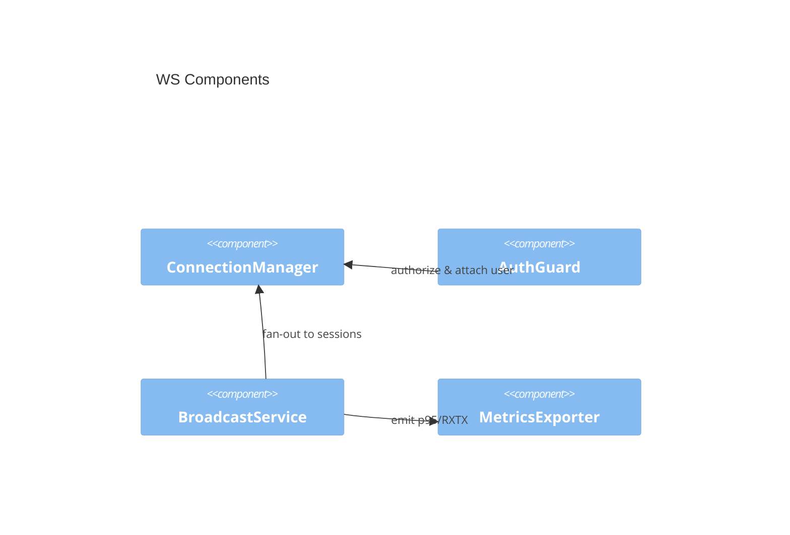

# WS Server Components

- 핵심 모듈: 연결관리, 인증, 브로드캐스트, 관측성

```mermaid
C4Component
  title WS Components
  Component(conn, "ConnectionManager")
  Component(auth, "AuthGuard")
  Component(bc, "BroadcastService")
  Component(metrics, "MetricsExporter")
  Rel(auth, conn, "authorize & attach user")
  Rel(bc, conn, "fan-out to sessions")
  Rel(bc, metrics, "emit p95/RXTX")
``` 