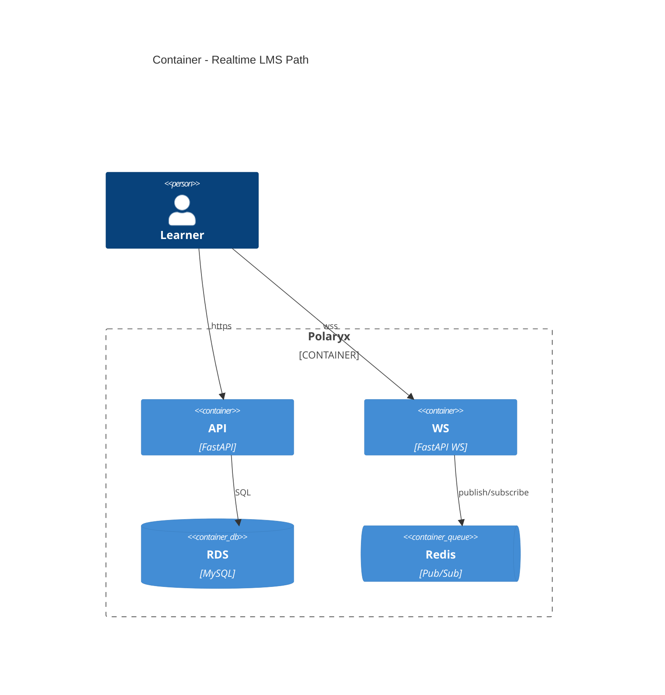

# Container Diagram - Realtime Path

- 실행 단위: API, WS, Redis, RDS
- 통신: Client↔API/WS, WS↔Redis, API↔RDS

```mermaid
C4Container
  title Container - Realtime LMS Path
  Person(user, "Learner")
  Container_Boundary(app, "Polaryx") {
    Container(api, "API", "FastAPI")
    Container(ws, "WS", "FastAPI WS")
    ContainerDb(db, "RDS", "MySQL")
    ContainerQueue(bus, "Redis", "Pub/Sub")
  }
  Rel(user, ws, "wss")
  Rel(user, api, "https")
  Rel(ws, bus, "publish/subscribe")
  Rel(api, db, "SQL")
``` 