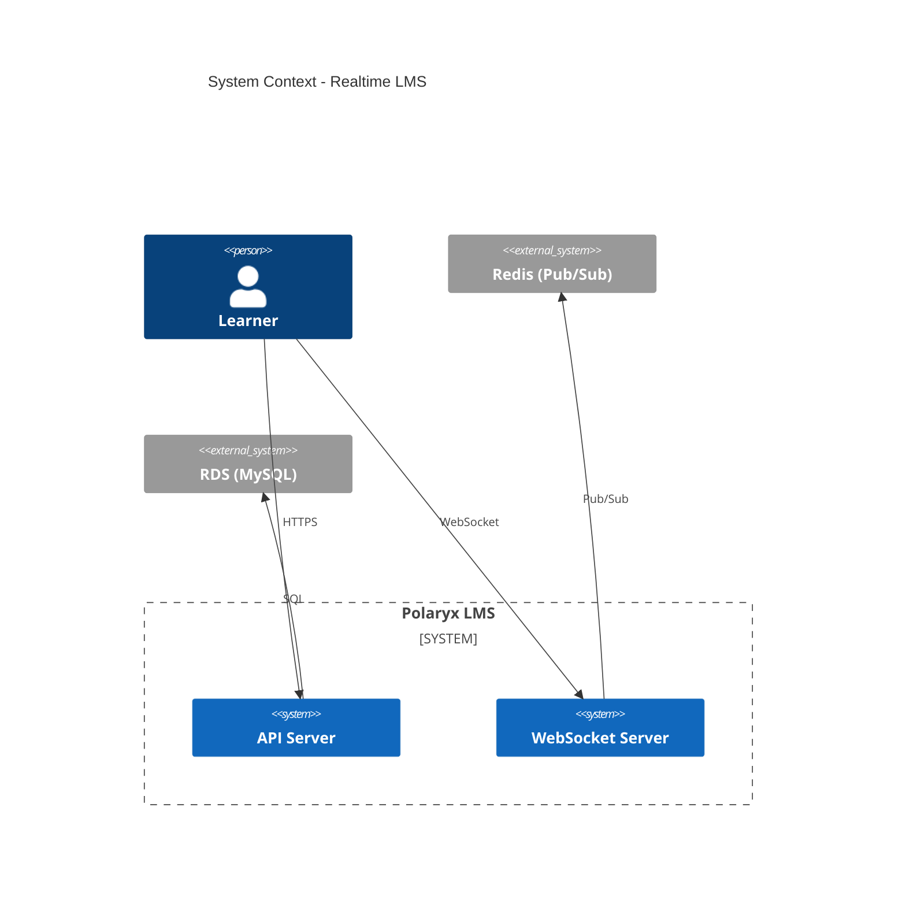

# System Context - Realtime LMS (Polaryx)

- 목적: 1000+ CCU 실시간 채팅을 안정적으로 제공
- 범위: 클라이언트, API/WS 서버, Redis Pub/Sub, RDS

```mermaid
C4Context
  title System Context - Realtime LMS
  Person(user, "Learner")
  System_Boundary(sys, "Polaryx LMS") {
    System(api, "API Server")
    System(ws, "WebSocket Server")
  }
  System_Ext(redis, "Redis (Pub/Sub)")
  System_Ext(rds, "RDS (MySQL)")
  Rel(user, ws, "WebSocket")
  Rel(user, api, "HTTPS")
  Rel(ws, redis, "Pub/Sub")
  Rel(api, rds, "SQL")
``` 