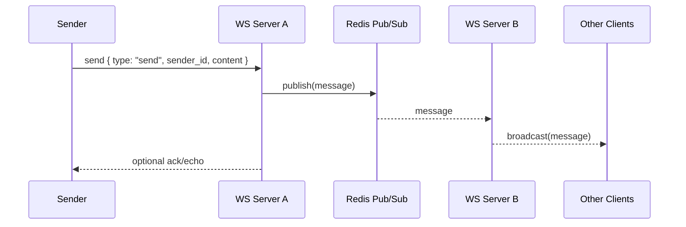

# WebSocket Broadcast Sequence

```mermaid
sequenceDiagram
  participant S as Sender
  participant W1 as WS Server A
  participant R as Redis Pub/Sub
  participant W2 as WS Server B
  participant C as Other Clients
  S->>W1: send { type: "send", sender_id, content }
  W1->>R: publish(message)
  R-->>W2: message
  W2-->>C: broadcast(message)
  W1-->>S: optional ack/echo
``` 