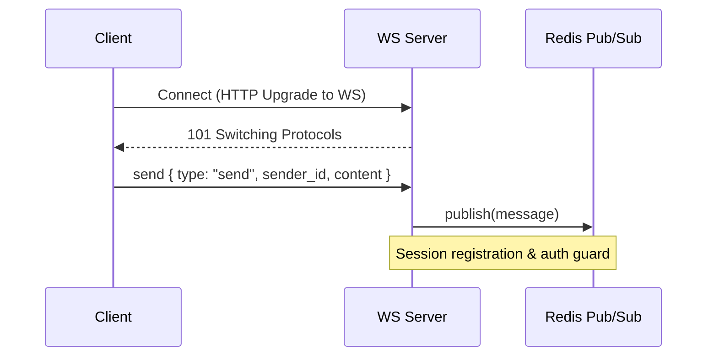

# WebSocket Handshake Sequence

```mermaid
sequenceDiagram
  participant C as Client
  participant WS as WS Server
  participant R as Redis Pub/Sub
  C->>WS: Connect (HTTP Upgrade to WS)
  WS-->>C: 101 Switching Protocols
  C->>WS: send { type: "send", sender_id, content }
  WS->>R: publish(message)
  Note over WS,R: Session registration & auth guard
``` 